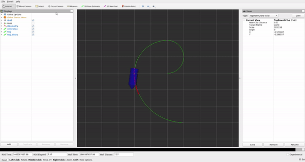

# Model Predictive Control

参考助教老师完成：

* [linearization](../src/mpc_car/include/mpc_car/mpc_car.hpp#L76)

* [constraints](../src/mpc_car/include/mpc_car/mpc_car.hpp#L217)

* [BB AA gg](../src/mpc_car/include/mpc_car/mpc_car.hpp#L314)

  $x_{k+1}$ 与 $x$ 是连乘，不是次方

* [qx](../src/mpc_car/include/mpc_car/mpc_car.hpp#L344)

