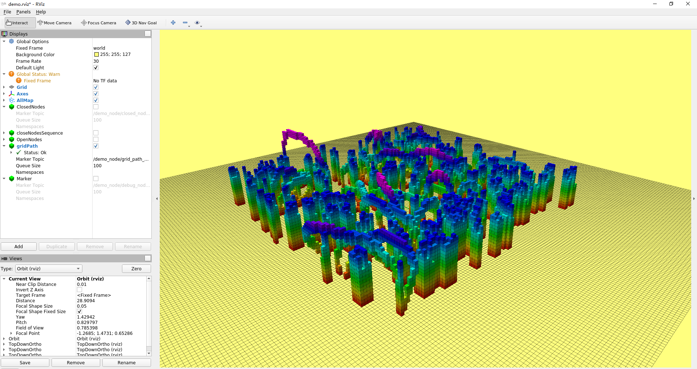

## MotionPlanning 课程环境配置

我本机环境为 *Windows 10* + *WSL2(Ubuntu 20.04)* + *Ros Noetic* , 使用 *X11 Server* 在 *Windows上* 显示 *WSL2* 的界面.

> 推荐使用 [MobaXterm](https://mobaxterm.mobatek.net/download.html) 作为终端工具, 集成了 *X11 Server*.

在我的环境下直接编译会报错，需要进行以下两处修改：

  ```bash
  diff --git a/CMakeLists.txt b/CMakeLists.txt
  index 46ff451..18b6b6f 100755
  --- a/CMakeLists.txt
  +++ b/CMakeLists.txt
  @@ -26,7 +26,7 @@ include_directories(
      ${PCL_INCLUDE_DIRS}
  )
  
  -set(CMAKE_CXX_FLAGS "-std=c++11 ${CMAKE_CXX_FLAGS} -O3 -Wall") # -Wextra -Werror
  +set(CMAKE_CXX_FLAGS "-std=c++14 ${CMAKE_CXX_FLAGS} -O3 -Wall") # -Wextra -Werror
  
  add_executable( demo_node 
      src/demo_node.cpp
  diff --git a/src/demo_node.cpp b/src/demo_node.cpp
  index 3f8f345..7708a42 100755
  --- a/src/demo_node.cpp
  +++ b/src/demo_node.cpp
  @@ -104,7 +104,7 @@ void rcvPointCloudCallBack(const sensor_msgs::PointCloud2 & pointcloud_map)
  
      pcl::toROSMsg(cloud_vis, map_vis);
  
  -    map_vis.header.frame_id = "/world";
  +    map_vis.header.frame_id = "world";
      _grid_map_vis_pub.publish(map_vis);
  
      _has_map = true;

  ```

运行截图

