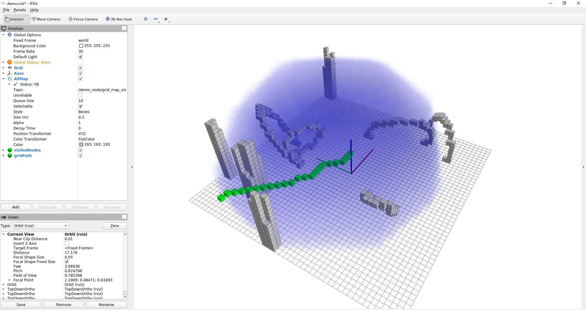
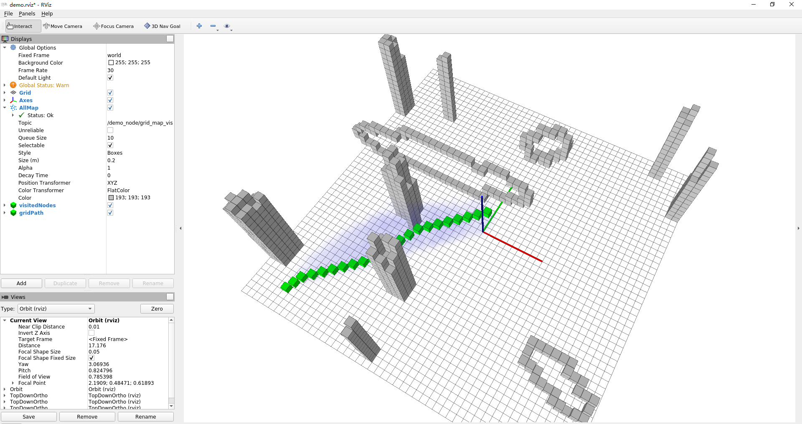
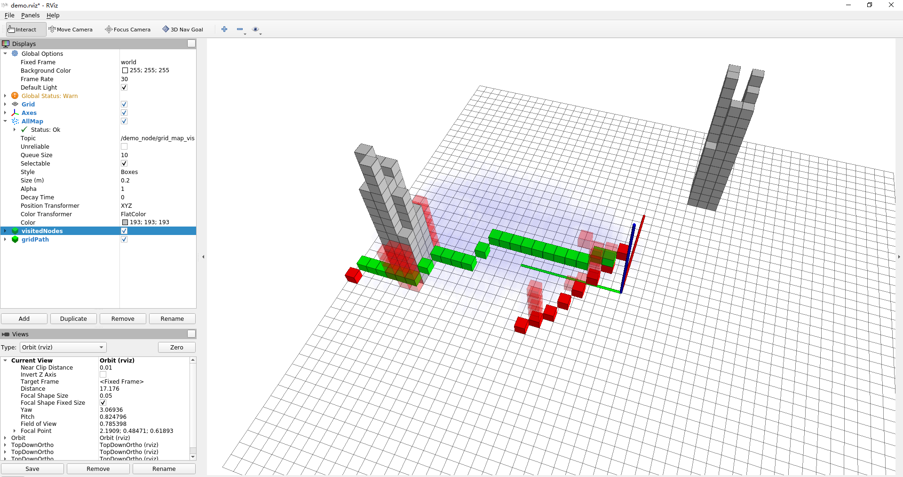
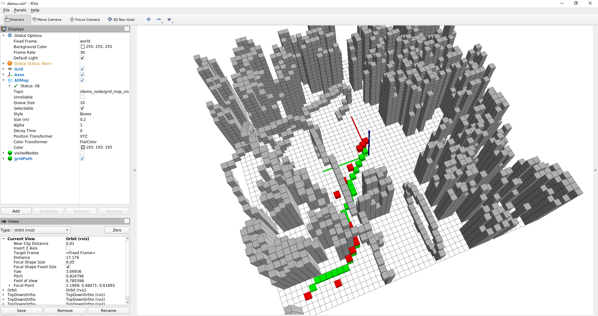
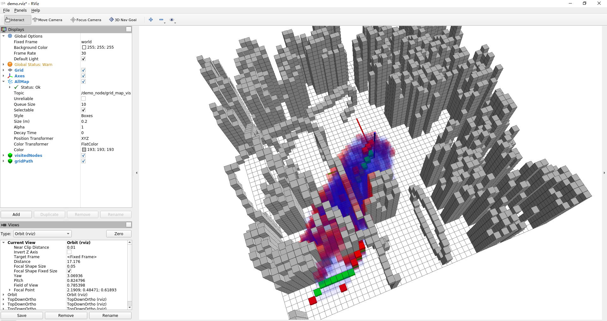

# Homework2 SEARCH-BASED PATH FINDING

## 算法实现流程

[void AstarPathFinder::AstarGetSucc(...)](../src/grid_path_searcher/src/Astar_searcher.cpp#L134)

[double AstarPathFinder::getHeu(...)](../src/grid_path_searcher/src/Astar_searcher.cpp#L164)

[void AstarPathFinder::AstarGraphSearch(...)](../src/grid_path_searcher/src/Astar_searcher.cpp#L191)

[vector<Vector3d> AstarPathFinder::getPath(...)](../src/grid_path_searcher/src/Astar_searcher.cpp#L329)

## Euclidean and Diagonal heuristic function

- Euclidean heuristic function
    
    使用*Eigen*的`norm`函数直接求出两节点的距离
    ```c++
    // Euclidean
    double h = (node1->coord - node2->coord).norm();
    ```

    
    ```bash
    [ WARN] [1657249475.365825800]: [A*]{sucess}  Time in A*  is 42.177300 ms, path cost if 6.052618 m
    [ WARN] [1657249475.365907600]:         Time consume in A* path finding AstarGetSucc is 18.987500 ms
    [ WARN] [1657249475.367065200]: visited_nodes size : 29590
    ```

- Custom heuristic function
    
    原本是想实现 3D Diagonal distance，但是好像不太对，但也能跑出来结果，而且比Euclidean heuristic function要快很多
    ```c++
    // Diagonal
    double dx = abs(node1->index.x() - node2->index.x());
    double dy = abs(node1->index.y() - node2->index.y());
    double dz = abs(node1->index.z() - node2->index.z());
    double dxdz = abs(dx - dz);
    double dydz = abs(dy - dz);
    double h = (dx + dy + dz) + (sqrt(2.0) - 2.0) * min(dxdz, dydz) + (sqrt(3.0) - 3.0) * min(min(dx, dy), dz);
    ```
    
    ```bash
    [ WARN] [1657249645.914920500]: [A*]{sucess}  Time in A*  is 1.961100 ms, path cost if 6.374691 m
    [ WARN] [1657249645.915042600]:         Time consume in A* path finding AstarGetSucc is 0.872800 ms
    [ WARN] [1657249645.915639700]: visited_nodes size : 846
    ```

- 使用欧式距离作为启发函数会增加很多不必要的探索点，使用自定义的 heuristic function 可以极大减少探索范围。


## JPS and A*

- JPS is slower than A*

    

    ```bash
    [ WARN] [1657246204.078784900]: [A*]{sucess}  Time in A*  is 1.221800 ms, path cost if 5.697736 m
    [ WARN] [1657246204.078858700]:         Time consume in A* path finding AstarGetSucc is 0.471000 ms
    [ WARN] [1657246204.079422800]: visited_nodes size : 834
    [ WARN] [1657246204.081826000]: [JPS]{sucess} Time in JPS is 1.688000 ms, path cost if 5.697736 m
    [ WARN] [1657246204.081900400]:         Time consume in JPS path finding JPSGetSucc is 1.643300 ms
    [ WARN] [1657246204.082415500]: visited_nodes size : 60
    ```
在较为空旷的情况下，JPS会花很多时间在探索下一个跳点上，如上例`95%`的时间在探索跳点上

- JPS is faster than A*
    

    

    ```bash
    [ WARN] [1657247014.815823900]: [A*]{sucess}  Time in A*  is 3.252700 ms, path cost if 6.886933 m
    [ WARN] [1657247014.815888300]:         Time consume in A* path finding AstarGetSucc is 1.334300 ms
    [ WARN] [1657247014.816652300]: visited_nodes size : 1973
    [ WARN] [1657247014.818374500]: [JPS]{sucess} Time in JPS is 1.035300 ms, path cost if 6.886933 m
    [ WARN] [1657247014.818431000]:         Time consume in JPS path finding JPSGetSucc is 0.664600 ms
    [ WARN] [1657247014.818910000]: visited_nodes size : 647
    ```
    在障碍物较多的情况下，JPS可以很快确定下一个跳点，最终比自定义启发函数的A*要快很多