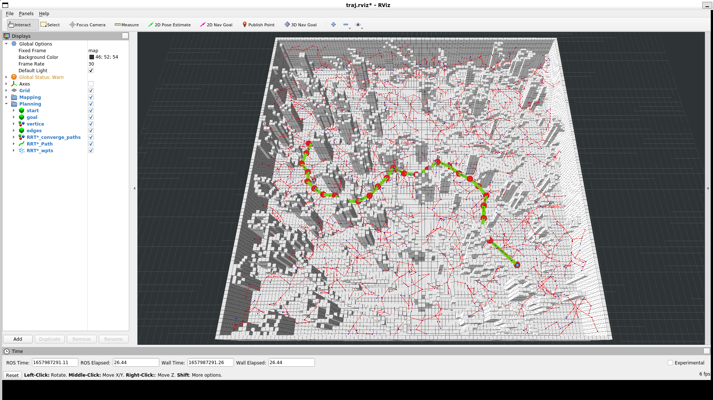
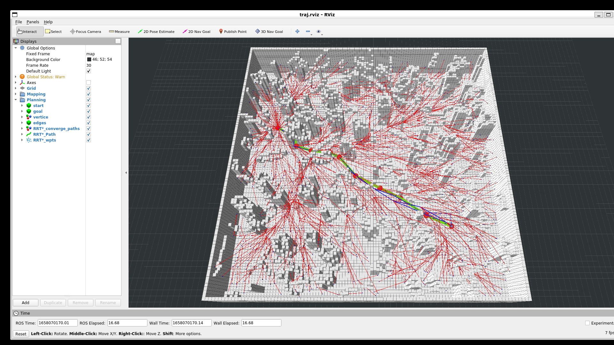
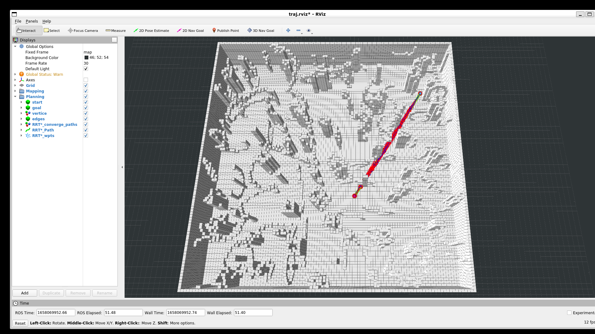
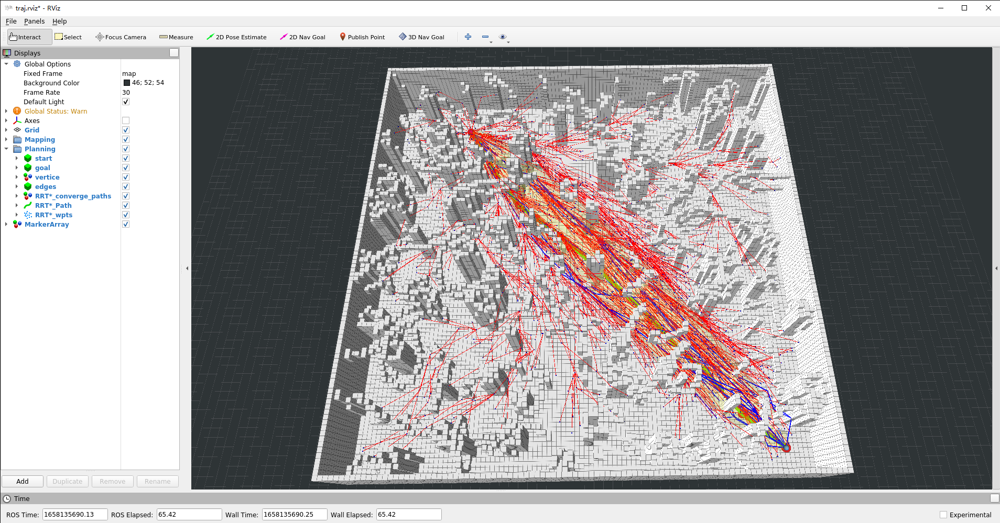

# L3 Sampling Based Path Finding

RRT 参数 `search_time` 太大会导致搜索到很多路径，`rviz` 显示非常卡，所以作业中将 `search_time` 统一设置为 `0.01`

## RRT



## RRT*

[Step1 - find parent](../HW_C%2B%2B/src/path_finder/include/path_finder/rrt_star.h#284)

[Step3 - rewire](../HW_C%2B%2B/src/path_finder/include/path_finder/rrt_star.h#345)

```bash
[ WARN] [1658070161.823655060]: 3D Goal Set
[ INFO] [1658070161.823962656]: Setting goal: Frame:map, Position(11.770, 15.621, 0.000), Orientation(0.000, 0.000, 0.000, 1.000) = Angle: 0.000

[ INFO] [1658070161.825017537]:
-----------------------------
goal rcved at 11.7698 15.6205       0
[ INFO] [1658070161.825659719]: [RRT*]: RRT starts planning a path
[ INFO] [1658070161.836160201]: [RRT*]: first path length: 46.4475, use_time: 0.00023
[ INFO] [1658070161.836456531]: [RRT*] final path len: 42.9842
```



## Informed-RRT*

[informed_rrt_start](../HW_C%2B%2B/src/path_finder/include/path_finder/rrt_star.h#L348)

[informedSamplingOnce](../HW_C%2B%2B/src/path_finder/include/path_finder/sampler.h#L70)

```bash
[ WARN] [1658069937.024682668]: 3D Goal Set
[ INFO] [1658069937.024835674]: Setting goal: Frame:map, Position(-16.646, 19.085, 0.000), Orientation(0.000, 0.000, 0.000, 1.000) = Angle: 0.000

[ INFO] [1658069937.025425774]:
-----------------------------
goal rcved at -16.6455  19.0855        0
[ INFO] [1658069937.025620369]: [RRT*]: RRT starts planning a path
[ INFO] [1658069937.036037114]: [RRT*]: first path length: 27.974, use_time: 0.000235501
[ INFO] [1658069937.036201722]: [RRT*] final path len: 27.9454
```


* Update

  由于目前作业框架第一次路径规划结果不会在`rviz`里显示，而我在 [plan](../HW_C%2B%2B/src/path_finder/include/path_finder/rrt_star.h#L64) 中没有重置 [sampler](../HW_C%2B%2B/src/path_finder/include/path_finder/sampler.h#L103) 的 [inform](../HW_C%2B%2B/src/path_finder/include/path_finder/sampler.h#L114)状态值，导致第二次`rrt*`一开始就是 `informed sampling space`，所以出现了上述情况。

  修改之后 `Informed RRT*` 正常。

  ```bash
  [ WARN] [1658135669.211250600]: 3D Goal Set
  [ INFO] [1658135669.211365200]: Setting goal: Frame:map, Position(22.030, 21.511, 0.000), Orientation(0.000, 0.000, 0.707, 0.707) = Angle: 1.571

  [ INFO] [1658135669.211678800]:
  -----------------------------
  goal rcved at 22.0297 21.5111       0
  [ INFO] [1658135669.211911400]: [RRT*]: RRT starts planning a path
  [ INFO] [1658135669.262554300]: [RRT*]: first path length: 63.2573, use_time: 0.0043453
  [ INFO] [1658135669.262723700]: [RRT*] final path len: 56.4433
  ```
  
