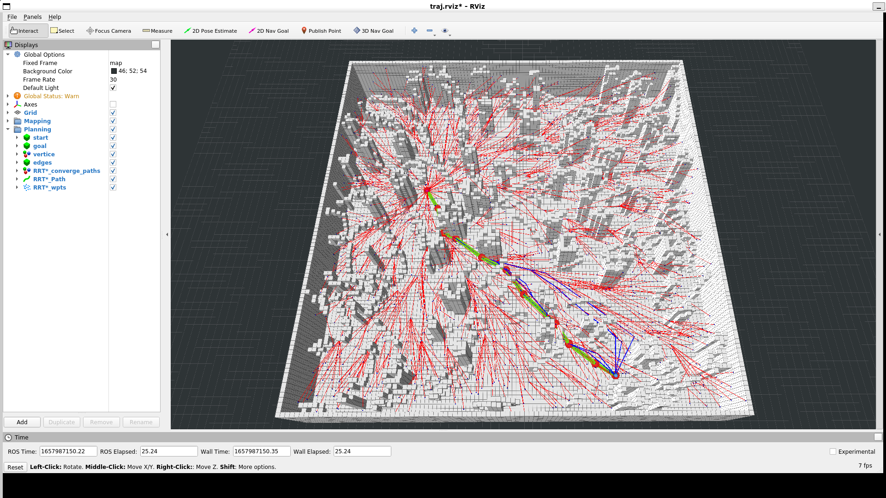

# L3 Sampling Based Path Finding

RRT 参数 `search_time` 太大会导致搜索到很多路径，`rviz` 显示非常卡，所以作业中将 `search_time` 统一设置为 `0.01`

## RRT

## RRT*

[Step1 - find parent](../HW_C%2B%2B/src/path_finder/include/path_finder/rrt_star.h#284)

[Step3 - rewire](../HW_C%2B%2B/src/path_finder/include/path_finder/rrt_star.h#345)

## Informed-RRT*
