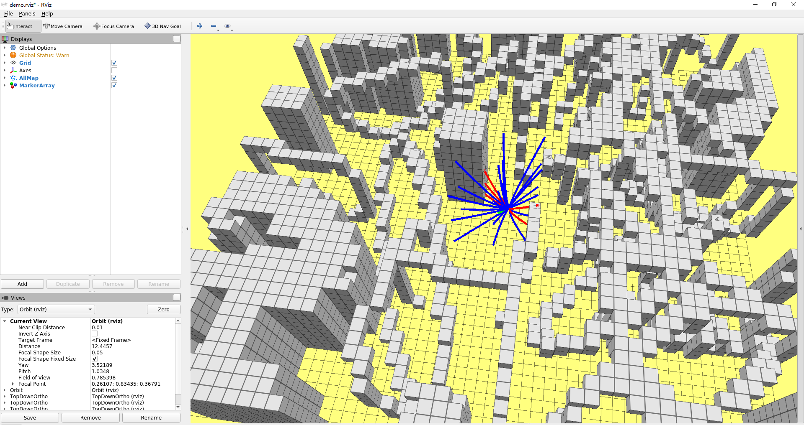

# L4 - KINODYNAMIC PATH FINDING

## Q1 - OBVP partially free final state

参考论文 [A computationally efficient motion primitive for quadrocopter trajectory generation](./mueTRO15.pdf) (Section Ⅲ - C - 2):

> These states may correspondingly be specifified as free when solving the optimal input trajectory, by noting that the corresponding costates must equal zero at the end time.

* Fixed position
  
  当只固定末端位置时, 末端速度和加速度对应的 `costate` ( $\lambda_{2}$ and $\lambda_{3}$ )为0. 
  
  根据
  
  $$
  \lambda{(t)} = \frac{1}{T} \left[\begin{matrix}
    -2\alpha \\
    2\alpha{t}+2\beta \\
    -\alpha{t^2}-2{\beta}t-2{\gamma}
  \end{matrix}\right]
  $$

  可得

  $$
  \begin{split}
    {\beta} &= -{\alpha}t \\
    {\gamma} &= \frac{1}{2}{\alpha}t^2
  \end{split}
  $$

  由论文中公式(22), 代入上式可得

  $$
  \begin{split}
    \frac{1}{20}{\alpha}T^5 &= {\Delta}p \\
    {\alpha} &= \frac{1}{T^5}*20{\Delta}p
    
  \end{split}
  $$

  回代 $\alpha$ , 得到：
  $$
    \begin{split}
      \left[\begin{matrix} \alpha \\ \beta \\ \gamma \end{matrix}
      \right] = \frac{1}{T^5}\left[\begin{matrix}
        20 \\ -20T \\ 10T^2
      \end{matrix} \right]\Delta{p}
    \end{split}
  $$

---

## Q2 - Optimal analytic expression of T

根据 PDF 中

$$
A = \left[\begin{matrix}- \frac{12}{T^{3}} & 0 & 0 & \frac{6}{T^{2}} & 0 & 0 \\ 0 & - \frac{12}{T^{3}} & 0 & 0 & \frac{6}{T^{2}} & 0 \\ 0 & 0 & - \frac{12}{T^{3}} & 0 & 0 & \frac{6}{T^{2}} \\ \frac{6}{T^{2}} & 0 & 0 & - \frac{2}{T} & 0 & 0 \\ 0 & \frac{6}{T^{2}} & 0 & 0 & - \frac{2}{T} & 0 \\ 0 & 0 & \frac{6}{T^{2}} & 0 & 0 & - \frac{2}{T}\end{matrix}\right]
$$

$$
b = \left[\begin{matrix}- T vx_{s} + px_{f} - px_{s} \\ - T vy_{s} + py_{f} - py_{s} \\ - T vz_{s} + pz_{f} - pz_{s} \\ vx_{f} - vx_{s} \\ vy_{f} - vy_{s} \\ vz_{f} - vz_{s}\end{matrix}\right]
$$

$$
\left[ \begin{matrix} \alpha{_1} \\ \alpha{_2} \\ \alpha{_2} \\ \beta{_1} \\ \beta{_2} \\ \beta{_3}  \end{matrix}\right]  
= \left[\begin{matrix} \frac{6 \left(T vx_{f} + T vx_{s} - 2 px_{f} + 2 px_{s}\right)}{T^{3}} \\ \frac{6 \left(T vy_{f} + T vy_{s} - 2 py_{f} + 2 py_{s}\right)}{T^{3}} \\ \frac{6 \left(T vz_{f} + T vz_{s} - 2 pz_{f} + 2 pz_{s}\right)}{T^{3}} \\ \frac{2 \left(- T vx_{f} - 2 T vx_{s} + 3 px_{f} - 3 px_{s}\right)}{T^{2}} \\ \frac{2 \left(- T vy_{f} - 2 T vy_{s} + 3 py_{f} - 3 py_{s}\right)}{T^{2}} \\ \frac{2 \left(- T vz_{f} - 2 T vz_{s} + 3 pz_{f} - 3 pz_{s}\right)}{T^{2}} \end{matrix} \right]
$$

运行脚本 [formula_derivation](./formula_derivation.py) 可以得到 $J$ ：

$$
\begin{split}
J=T &+ \frac{4 \left(- T vx_{f} - 2 T vx_{s} + 3 px_{f} - 3 px_{s}\right)^{2}}{T^{3}} \\ &+ \frac{12 \left(- T vx_{f} - 2 T vx_{s} + 3 px_{f} - 3 px_{s}\right) \left(T vx_{f} + T vx_{s} - 2 px_{f} + 2 px_{s}\right)}{T^{3}} \\ &+ \frac{12 \left(T vx_{f} + T vx_{s} - 2 px_{f} + 2 px_{s}\right)^{2}}{T^{3}} \\ &+ \frac{4 \left(- T vy_{f} - 2 T vy_{s} + 3 py_{f} - 3 py_{s}\right)^{2}}{T^{3}} \\ &+ \frac{12 \left(- T vy_{f} - 2 T vy_{s} + 3 py_{f} - 3 py_{s}\right) \left(T vy_{f} + T vy_{s} - 2 py_{f} + 2 py_{s}\right)}{T^{3}} \\ &+ \frac{12 \left(T vy_{f} + T vy_{s} - 2 py_{f} + 2 py_{s}\right)^{2}}{T^{3}} \\ &+ \frac{4 \left(- T vz_{f} - 2 T vz_{s} + 3 pz_{f} - 3 pz_{s}\right)^{2}}{T^{3}} \\ &+ \frac{12 \left(- T vz_{f} - 2 T vz_{s} + 3 pz_{f} - 3 pz_{s}\right) \left(T vz_{f} + T vz_{s} - 2 pz_{f} + 2 pz_{s}\right)}{T^{3}} \\ &+ \frac{12 \left(T vz_{f} + T vz_{s} - 2 pz_{f} + 2 pz_{s}\right)^{2}}{T^{3}}
\end{split}
$$

对 $T$ 求导，可得：

$$
\begin{split}
g^{'}(T)=1 &+ \frac{- 4 vx_{f}^{2} - 4 vx_{f} vx_{s} - 4 vx_{s}^{2} - 4 vy_{f}^{2} - 4 vy_{f} vy_{s} - 4 vy_{s}^{2} - 4 vz_{f}^{2} - 4 vz_{f} vz_{s} - 4 vz_{s}^{2}}{T^{2}} \\ &+ \frac{24 px_{f} vx_{f} + 24 px_{f} vx_{s} - 24 px_{s} vx_{f} - 24 px_{s} vx_{s} + 24 py_{f} vy_{f} + 24 py_{f} vy_{s} - 24 py_{s} vy_{f} - 24 py_{s} vy_{s} + 24 pz_{f} vz_{f} + 24 pz_{f} vz_{s} - 24 pz_{s} vz_{f} - 24 pz_{s} vz_{s}}{T^{3}} \\ &+ \frac{- 36 px_{f}^{2} + 72 px_{f} px_{s} - 36 px_{s}^{2} - 36 py_{f}^{2} + 72 py_{f} py_{s} - 36 py_{s}^{2} - 36 pz_{f}^{2} + 72 pz_{f} pz_{s} - 36 pz_{s}^{2}}{T^{4}}
\end{split}
$$

令 $g^{'}(T)=0$ , 并且等式两边同乘 $T^4$ , 可得：

$$
\begin{split}
g^{'}(T) = 
T^{4} &+ T^{2} \left(- 4 vx_{f}^{2} - 4 vx_{f} vx_{s} - 4 vx_{s}^{2} - 4 vy_{f}^{2} - 4 vy_{f} vy_{s} - 4 vy_{s}^{2} - 4 vz_{f}^{2} - 4 vz_{f} vz_{s} - 4 vz_{s}^{2}\right) \\ &+ T \left(24 px_{f} vx_{f} + 24 px_{f} vx_{s} - 24 px_{s} vx_{f} - 24 px_{s} vx_{s} + 24 py_{f} vy_{f} + 24 py_{f} vy_{s} - 24 py_{s} vy_{f} - 24 py_{s} vy_{s} + 24 pz_{f} vz_{f} + 24 pz_{f} vz_{s} - 24 pz_{s} vz_{f} - 24 pz_{s} vz_{s}\right) \\ &- 36 px_{f}^{2} + 72 px_{f} px_{s} - 36 px_{s}^{2} - 36 py_{f}^{2} + 72 py_{f} py_{s} - 36 py_{s}^{2} - 36 pz_{f}^{2} + 72 pz_{f} pz_{s} - 36 pz_{s}^{2} = 0
\end{split}
$$

利用 `Eigen` 中的伴随矩阵求解多项式根, 完成相关函数 [trajectoryLibrary](../src/grid_path_searcher/src/demo_node.cpp#L111) 和 [OptimalBVP](../src/grid_path_searcher/src/hw_tool.cpp#L86)

运行结果如图, 其中蓝色线段为生成的轨迹库, 绿色线段为代价最小的轨迹，红色线段为有碰撞检测的轨迹

