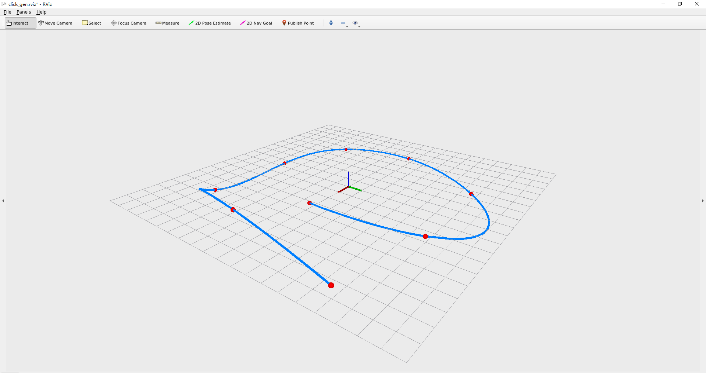

# L5 - Optimization-Based Trajectory Planning

参考论文 *Geometrically Constrained Trajectory Optimizationfor Multicopters*

计算出几个关键参数：

在 $ti$ 时刻只经过固定航点, 所以 $d_{i} = 1$

计算 minimum jerk trajectory, $s=3$

所以有 $\overline{d_{i}} = 2s - 1=5$

根据论文中公式分别计算出$F_0$ , $E_M$,  $F_i$, $E_i$

实现 [minimumJerkTrajGen](../src/src/click_gen.cpp#L55)

```bash
[ INFO] [1658973260.525905200]: pieceNum : 2

timeAllocationVector : 8.11624 6.40985
F0 :
1 0 0 0 0 0
0 1 0 0 0 0
0 0 2 0 0 0
EM :
      1 8.11624 65.8733 534.644  4339.3 35218.8
      0       1 16.2325  197.62 2138.58 21696.5
      0       0       2 48.6974  790.48 10692.9
M
      1       0       0       0       0       0       0       0       0       0       0       0
      0       1       0       0       0       0       0       0       0       0       0       0
      0       0       2       0       0       0       0       0       0       0       0       0
      1 6.40985 41.0861 263.356 1688.07 10820.3       0       0       0       0       0       0
      1 6.40985 41.0861 263.356 1688.07 10820.3      -1       0       0       0       0       0
      0       1 12.8197 123.258 1053.42 8440.35       0      -1       0       0       0       0
      0       0       2 38.4591 493.034 5267.12       0       0      -2       0       0       0
      0       0       0       6 153.836 2465.17       0       0       0      -6       0       0
      0       0       0       0      24 769.182       0       0       0       0     -24       0
      0       0       0       0       0       0       1 8.11624 65.8733 534.644  4339.3 35218.8
      0       0       0       0       0       0       0       1 16.2325  197.62 2138.58 21696.5
      0       0       0       0       0       0       0       0       2 48.6974  790.48 10692.9
b
 8.35192  5.44437        0
       0        0        0
       0        0        0
 7.61859 -1.55405  1.06073
       0        0        0
       0        0        0
       0        0        0
       0        0        0
       0        0        0
 5.34353 -6.34627        0
       0        0        0
       0        0        0
x
     8.35192      5.44437 -9.05439e-15
-2.64233e-14  3.67928e-13  -6.1999e-14
-1.09684e-11  2.23471e-12 -1.53397e-12
-0.000842974   -0.0869109     0.021503
-0.000612813    0.0127535  -0.00389779
 4.83478e-05 -0.000521124  0.000182763
     7.61859     -1.55405      1.06073
   -0.341383     -1.67616    0.0869806
   -0.039952      0.10028   -0.0660625
  0.00330911    0.0259707  -0.00334387
 0.000936697  -0.00394815   0.00195961
-7.68438e-05  0.000154838 -0.000117281
```

运行截图

